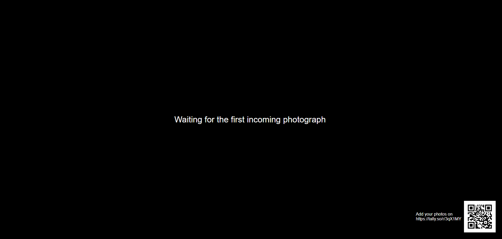

# :camera: Dynamic Slideshow  
Un diaporama collaboratif en temps réel, avec intégration de formulaires en ligne

## :eyes: Objectifs de ce projet
L'objectif de projet est de créer automatiquement un diaporama depuis une liste de photos, avec la possibilité pour des 
invités de contribuer à ce jeu de photos.
Quand une photo est ajoutée, le diaporama est mis à jour automatiquement (pas besoin de le relancer).

La capture d'écran ci-dessous illustre ce à quoi ressemble le diaporama :


## :mag: Comment ça fonctionne

Tous les invités disposent d'un lien vers un formulaire en ligne, hébergé sur Tally, depuis lequel ils peuvent 
directement déposer des photos depuis leurs terminaux (téléphone, tablette, ordinateur...).

Plus précisément, un script Python télécharge à intervales réguliers les images depuis Tally et crée un liste des 
fichiers sous la forme d'un fichier JSON. 
En parallèle, une page web, ouverte dans un navigateur, lit le fichier JSON pour afficher les photos sous la forme d'un
diaporama. Le fichier JSON est ainsi mis à jour périodiquement par Python, et lu à intervales réguliers par le 
diaporama.


## :ballot_box_with_check: Fonctionalités
Comme décrit ci-dessus, le diaporama est mis à jour automatiquement. De plus, il dispose des fonctionalités suivantes :
 - Affichage d'un lien et d'un QR code vers le formulaire de dépot Tally,
 - Affichage du nom/pseudo du contributeur,
 - Un détecteur de contenu inapproprié (Not Safe For Work, NSFW) filtre les photos affichées.

Les images nouvellement ajoutées sont mise en haut de la liste, de façon à ce qu'elle soient affichées en priorité.

## :vertical_traffic_light: Dépendances
Si vous ne souhaitez pas utiliser le détecteur de contenu NSFW, il n'y a pas de restriction particulière concernant la
version de Python. Mais si vous souhaitez utiliser le détecteur de contenu, il faudra utiliser :
- Python 3.10
- Tensorflow 2.10.0


## :construction_worker: Installation
### :baggage_claim: Travail préliminaire
#### Crétaion d'un formulaire Tally 
<a href="url"></a>
Enregistrez ou connectez-vous sur [Tally](https://tally.so/) et créez un formulaire avec ces deux champs :
 - champ de dépot de fichiers pour tout type d'images,
 - un champs de réponse courte, qui servira pour afficher l'auteur de la ou les photos.


Après avoir mis en forme ledit formulaire, publiez-le (bouton ``publish`` en haut à droite). 
Le lien de partage ressemble alors à quelque-chose comme ça : https://tally.so/r/XXXXX où XXXXX correspond à l'ID du 
formulaire. Notez bien cet ID, nous en aurons besoin plus tard.


#### Générez un jeton d'API pour Tally
Dans les paramètres de votre compte Tally, ouvrez l'onglet "API key", et créez une nouvelle clé d'API. 
Cette fois encore, notez bien la valeur de cette clé.

#### Générez un QR code vers le formulaire
Depuis l'URL publique du formulaire Tally, générez le QR code associé. Il existe plusieurs solutions pour celà, mais
mais je vous conseille d'utiliser [Inkscape](https://inkscape.org/fr/) (voir [ici](https://www.youtube.com/watch?v=Ak_tYjtAKWc) pour la procédure détaillée).

### :wrench: Configuration
Editez ``config.json``. Les champs obligatoires sont :

 - ``tally_form_id``: ID du formulaire Tally
 - ``tally_api_key``: clé d'API Tally
 - ``watermarkText``: Texte à afficher à côté du QR code dans le diaporama
 - ``watermarkQR``: chemin vers le fichier image du QR code

> [!NOTE] 
> Si vous ne voulez pas que la clé d'API apparaisse en clair dans votre fichier de configuration, il est possible de la
> définir en tant que variable d'environnement sous le nom ``TALLY_API_KEY``.

D'autres options sont disponibles dans le fichier de configuration, voir [plus bas](#muscle-optional-parameters) pour plus de détails.

## :runner: Lancez le serveur
Une fois toutes les étapes précédentes réalisées, lancez simplement ``main.py`` et laissez-le tourner en arrière-plan.

## :dancer: Lancez le diaporama
Le diaporama doit être lancé depuis un navigateur web. **Inutile d'essayer d'ouvrir ``index.html`` directement, celà ne
fonctionnera pas !**. Ceci est dû au fait que, par mesure de sécurité, la plupart des navigateurs bloquent l'accès de 
Javascript aux fichiers locaux.

A la place, ouvrez une console Python, déplacez-vous dans le dossier parent de ``index.html``, et lancez :

````bash
python -m http.server 8000
````

Ensuite, ouvrez http://localhost:8000/index.html dans le navigateur de votre choix. Celà devrait ressembler à ça :


Sinon, si vous travaillez avec PyCharm, ouvrez ``index.html`` depuis ce dernier, puis lancez le fichier dans le
un des navigateurs proposés via les boutons qui s'affichent en haut à droite :


<a href="url"></a>

> [!TIP] 
> Sous Chrome ou Firefox, passez en plein écran avec la touche F11.

## :muscle: Paramètres optionnels
Le fichier de configuration peut être agrémenté des paramètres optionnels suivants :

### :snake: Comportement du script Python
- ``imageList``: Chemin vers le fichier JSON liste des images
- ``tally_refresh_period``: Temps entre deux mises à jour des réponses Tally 

### :trollface: filtre NSFW 
- ``nsfw_filter``: active ou désactive le filtre (doit être ``true`` ou ``false``)
- ``nsfw_max_value``: si le filtre est activé, définit le seuil de détection de contenu pornographique ; 
il doit être compris entre 0 (ne rien autoriser) et 1 (autorise tout);
- ``nsfw_saved_model``: chemin vers le modèle NSFW entrainé. Celui-ci peut être téléchargé ici :
https://github.com/GantMan/nsfw_model/releases/tag/1.1.0

### :camera: Paramètres du diaporama
- ``intervalSlideshow``: temps de pause entre deux images (en secondes)
- ``intervalRefresh``: temps entre deux relectures de la liste des photos (en secondes)

### :sunglasses: Apparence du diaporama
Si nécessaire, il est possible de modifier l'apparence du diaporama (tailles des polices, couleurs etc.) en modifiant
le fichier``style.css``.

## :first_quarter_moon_with_face: Avant de lancer le diaporama
Pensez à désactiver les écrans de veille et de vérrouillage de votre ordinateur avant de lancer le diaporama !