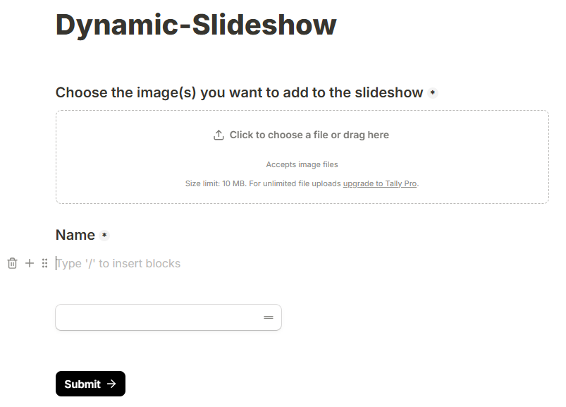
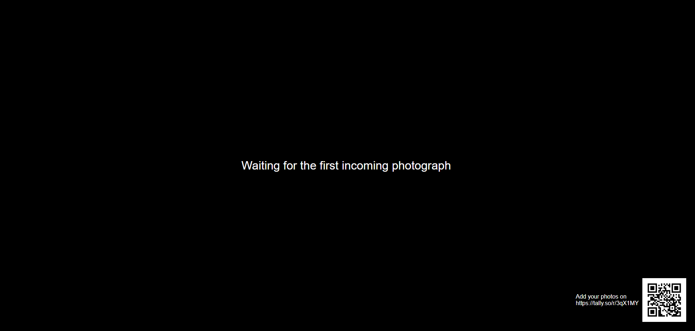
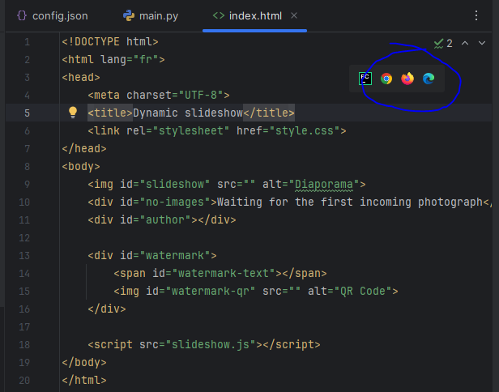

# :camera: Dynamic Slideshow  
A collaborative, real-time image slideshow with online form integration.

## :eyes: Aim of this work 
The aim of this project is to automatically create a slideshow from a list of images, with the opportunity for anyone to contribute to this set. 
Once an image is added, the slideshow is updated seamlessly (no need to restart it).

The screenshot below illustrates how it looks like:


## :mag: How it works
All guests are provided with a link (or QR code) to an online form, hosted on Tally, where they can freely upload 
photographs from their devices. 

In details, a Python script iteratively downloads these images on a local folder, and creates a list of images as a JSON
file. In parallel, the slideshow, running on a web browser (HTML/Javascript code), reads the file list from the JSON file and 
displays the images. The file list is updated periodically to allow live updates.

## :ballot_box_with_check: Features
As mentioned above, the slideshow is updated continuously. In addition, it provides the following features:
 - Displays a link and the associated QR code to the Tally's form used for sending the images
 - Displays the name of the contributor
 - A Not Safe For Work (NSFW) detector to avoid explicit content (pornography)

Every new image is added on top of the file list, so that newly added files are read first.

## :vertical_traffic_light: Requirements
If you don't want to use the NSFW detector, there is no strong requirement for using this project. 
Otherwise, I encourage you to use:
- Python 3.10
- Tensorflow 2.10.0


## :construction_worker: Installation
### :baggage_claim: Prerequities
#### Create a Tally form
<a href="url"></a>
Login/register to [Tally](https://tally.so/) and create a form with these two fields:
 - a file upload field for all image files
 - a short answer field (used for authorship)


Once it fits with all your needs, publish it. The share link will look like this https://tally.so/r/XXXXX where XXXXX denotes 
the form ID. Keep record of it.

#### Generate a Tally API token
In Tally's settings area, go to API key tab, and create a new API key.

#### Generate the QR code
Use the share link to Tally form to generate the associated QR code, and save it as an image. There are plenty of 
solutions to do that, but I suggest using [Inkscape](https://inkscape.org/fr/) 
(see [here](https://www.youtube.com/watch?v=Ak_tYjtAKWc) for details).

### :wrench: Configuration
Edit ``config.json``. The mandatory fields are:

 - ``tally_form_id``: ID of the associated form
 - ``tally_api_key``: Tally API key
 - ``watermarkText``: Text to display near the QR code
 - ``watermarkQR``: path to QR code image

> [!NOTE] 
> If you don't want the Tally API key to clearly appear in your configuration file, you can also set it as an 
> environment variable named ``TALLY_API_KEY``.

Other options are available in this file, see [below](#muscle-optional-parameters) for details.

## :runner: Run the server
Once all the preceding steps are done, simply run ``main.py`` and keep it running in the background.

## :dancer: Run the slideshow
The slideshow must be run in a web browser. **Don't try to open ``index.html`` directly, this won't work!**
This is because most browsers block local JavaScript access to file systems for security reasons.

Instead, open a Python console, cd to the parent directory of ``index.html``, and run:

````bash
python -m http.server 8000
````

Then, open http://localhost:8000/index.html in your browser of choice. It must look like this:


Alternatively, if you use PyCharm, use it to open ``index.html``, then run it directly in a
web browser with one of the displayed buttons:



## :muscle: Optional parameters
The configuration file may contain the following optional arguments:

### :snake: Python's script configuration
- ``imageList``: path to image/author list file
- ``tally_refresh_period``: sets the waiting duration before updating the file list from Tally (in seconds)

### :trollface: NSFW filter 
- ``nsfw_filter``: Turn on/off the NSFW filter (must be ``true`` of ``false``)
- ``nsfw_max_value``: if the NSFW filter is on, sets the threshold value for explicit content detection; it must be 
between (forbid everything) and 1 (allow everything)
- ``nsfw_saved_model``: path to the trained model for NSFW detection. They can be downloaded on:
https://github.com/GantMan/nsfw_model/releases/tag/1.1.0

### :camera: Slideshow configuration
- ``intervalSlideshow``: time interval between two subsequent images (in seconds)
- ``intervalRefresh``: sets the duration for the slideshow for checking if the file list has changed (in seconds)
