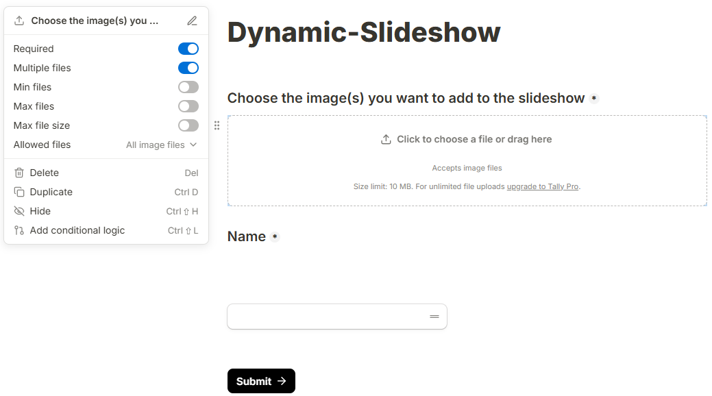

# Dynamic-slideshow

## Aim of this work
The aim of this project is to automatically create a slideshow from a list of images, with the opportunity for anyone to contribute to this set. 
Once an image is added, the slideshow is updated seamlessly (no need to restart it)

## How it works
All guests are provided with a link (or QR code) to an online form, hosted on Tally, where they can freely upload photographs from their devices. 
A Python script iteratively downloads these images on a local folder, and creates a list of images a JSON file.
In parallel, the slideshow, running on a web browser (HTML code), reads the file list from the JSON file and displays the images. 
The file list is updated periodically to allow live updates.

Note : every new image is added ontop of the file list, so that newly added files are read first.

## Installation
### Prerequities
#### Create a Tally form
Login/register to [Tally](https://tally.so/) and create a form with these two fields:
 - a file upload field
 - a short answer field



Once it fits with all your needs, publish it. The share link will somehow  https://tally.so/r/XXXXX where XXXXX denotes 
the form ID. Keep record of it.

#### Generate a Tally API token
In Tally's settings area, go to API key tab, and create a new API key.

#### Generate the QR code
Use the share link to Tally form to generate the associated QR code, and save it as an image. There are plenty of 
solution to do that, but I suggest using [Inkscape](https://inkscape.org/fr/) 
(see [here](https://www.youtube.com/watch?v=Ak_tYjtAKWc) for details).

### Configuration
Edit ``config.json``. The mandatory fields are:

 - ``tally_form_id``: ID of the associated form
 - ``tally_api_key``: Tally API key
 - ``watermarkText``: Text to display near the QR code
 - ``watermarkQR``: path to QR code image

Other options are available in this file, see below for details.

## Run the server
Once all the preceding steps are done, simply run ``main.py`` and keep it running in the background.

## Run the slideshow
The slideshow must be run in a web browser. **Don't try to open ``index.html`` directly, this won't work!**
This is because, for security reason, most web browsers disable the Javascript ``fetcth`` command when opening a local
file.

Instead, open a Python console, cd to the parent directory of ``index.html``, and run:

````bash
python -m http.server 8000
````

Then, open http://localhost:8000/index.html in your browser of choice.

## Optional parameters
